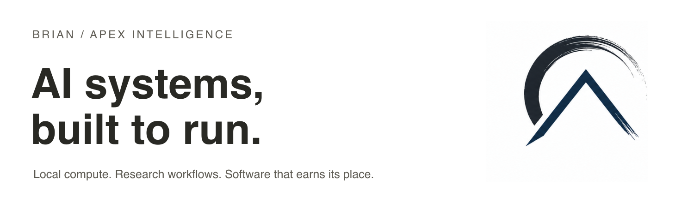

I'm **Brian**, the builder behind **Apex Intelligence**. I build software for research, local AI, and better decisions.

[LinkedIn](https://www.linkedin.com/in/brianwperez/) · [Apex Intelligence](https://apexintelligencelabs.com)

My background spans mechanical engineering and quantitative economics. I work with Claude, Codex, and local models, with a focus on clear requirements, useful tests, and recoverable systems.

## Selected work

| Project | What I've built | Stage |
| :--- | :--- | :--- |
| **Knowledge Base Engineering** | A Python runtime and guided workflow for turning scattered files into a portable, AI-ready knowledge base. | In development |
| **AI & Economic Daily Briefs** | Scheduled pipelines for ingestion, synthesis, email delivery, and health checks, with a local-model fallback. | Operating privately |
| **Local AI Lab** | Benchmarking, task-routing, and agent-harness tooling on NVIDIA GB10 hardware. | Experiments |

Project repositories are private. These summaries describe the work and its current stage.

## The engineering I enjoy

- **Make the whole loop work.** Ingest, reason, produce an output, verify it, and recover when a dependency fails.
- **Measure local models.** Understand latency, throughput, and task quality on hardware I operate.
- **Keep context portable.** Store decisions and project state in files that survive a change of tool or model.
- **Build across the stack.** Python automation, SQL data models, TypeScript interfaces, and native SwiftUI apps.

**Working stack:** Python · SQL/SQLite · TypeScript/JavaScript · Swift/SwiftUI · Linux/systemd · Ollama · Git

**Current focus:** Knowledge Base Engineering and reliable handoffs between AI tools.

Validation snapshot, September 9, 2026: the selected Knowledge Base Engineering runtime ran 147 tests, with 145 passing and 2 skipped. It remains a development project.
